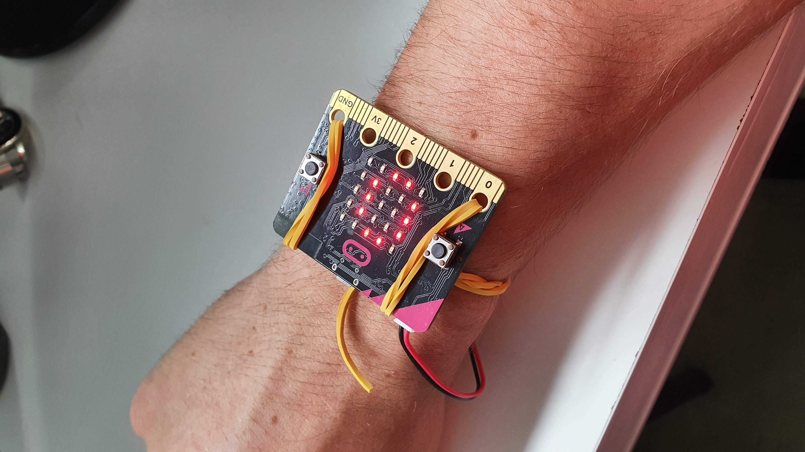
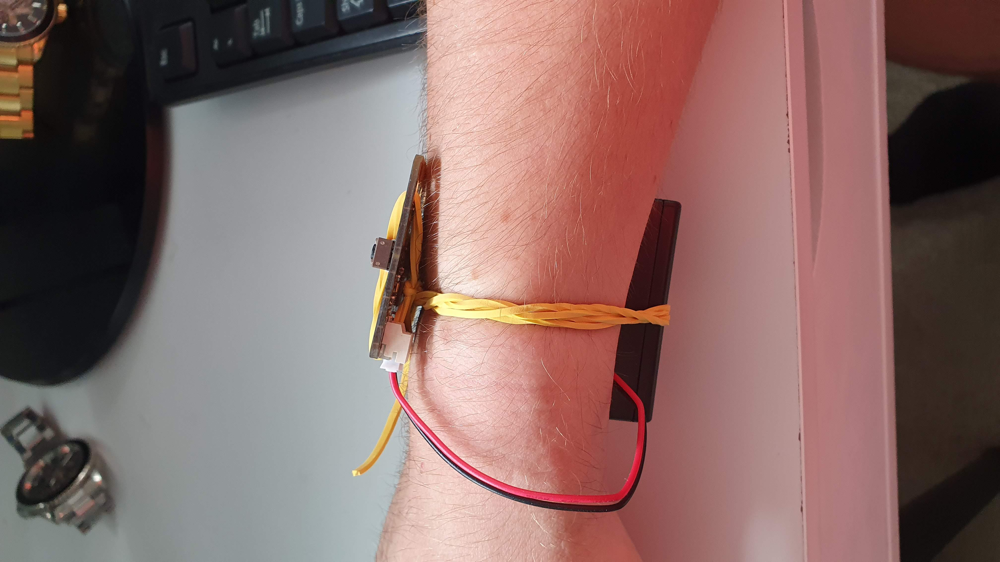
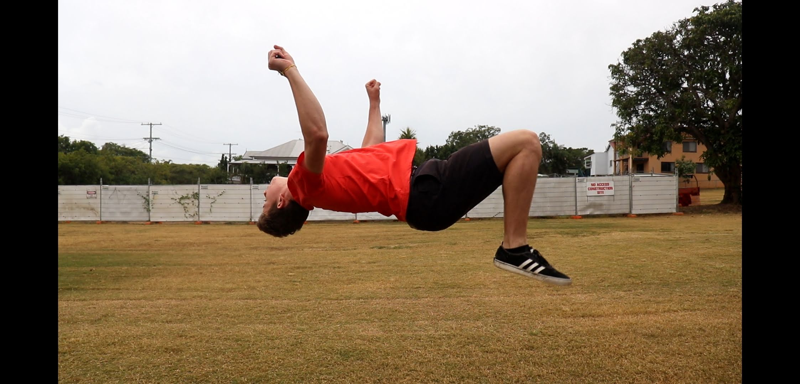

# *Backflip Counter*
## *Andrew Carter* ##
## 1701QCA Making Interaction 2020 Final Project ##

<!--- When you have completed the template, submit the link to the GitHub Pages site for this repository as a link in Learning@Griffith. The link should be something like [https://qcainteractivemedia.github.io/1701QCA-Assessment3/](https://qcainteractivemedia.github.io/1701QCA-Assessment3/) where `qcainteractivemedia` is replaced with your GitHub username and `1701QCA-Assessment3` is replaced with whatever you called the repository this template is contained in when you set it up. You should NOT be submitting a link that begins with github.com/[your user name] as that is not the rendered version. See the instructions about creating GitHub pages to see how to get the link to the rendered page. --->

## Showcase Images ##
 

This project is the one and only backflip counter. The project straps onto your wrist and keeps count of how many flips you do. It is for people who love doing flips to wear when they have a session, or on the trampoline and get data about how many flips they do, or just try to beat their high score. 

backflip with it on

(https://www.youtube.com/watch?v=Cj-7E5hCcxc) Watch the backflip counter in Action here

### Journal ###
[Process and reflection journal](/journal/journal.md) 
