# 1701QCA Final project journal: *Andrew Carter*

## Related projects ##

### Related project 1 ###
Micro bit Step Counter
https://makecode.microbit.org/projects/step-counter 
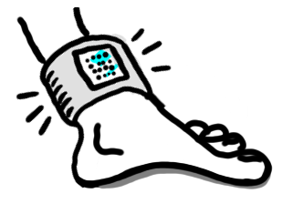

This project is related to mine because lots of the coding is the same. However instead of an element been on each ‘step’ it is on each ‘rotation’ to add a counter on the micro bit.  About half of my coding stems from this project. 

### Related project 2 ###
Basketball score counter
https://www.dfrobot.com/blog-1008.html
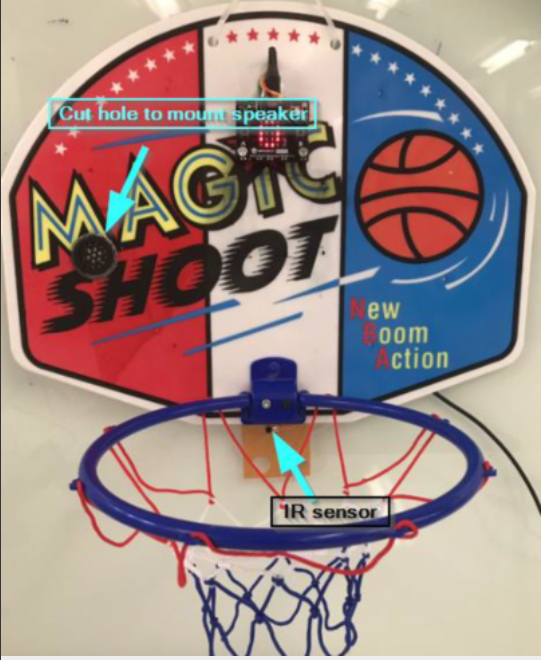

This project is related to mine because it is also a score counter, but for every time the ball is shot into the basketball hoop. For their invention, they had a unique idea and used extra equipment such as DuPont cables, digital mobile speaker, and a micro mate. Using these sensors allowed DFRobot to create an innovative project.

### Related project 3 ###
Micro bit Counter

https://www.instructables.com/id/How-to-Make-a-Counter-With-Microbit/
No Image available

This project demonstrated to me the fundamentals of creating a counter. This tutorial shows what materials you will need to make the project and the programming steps used to set it up. The counter used in this tutorial is a counter of how many times the button is pressed. When the button ‘A’ and ‘B’ are pressed together the counter resets. Since my counter was sensor based with the rotation of the micro bit, I created my project so that it resets with just one button press. 

### Related project 4 ###
Mircobit Stop Watch
https://makecode.microbit.org/projects/stopwatch
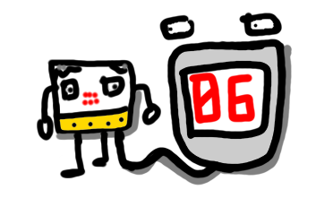

This project is related to mine because it has the same reset function. This project instead of counting flips counts the seconds that go by after the button is pressed. The code of this project looks similar to mine as it contains a few of the same elements.

### Related project 5 ###
Step Counter with rewards 

*Insert URL to project*

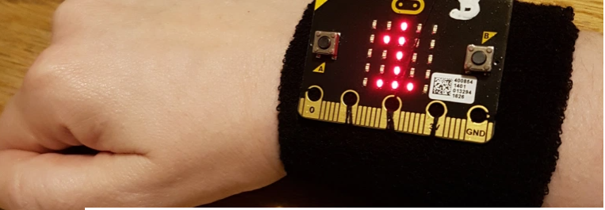

This project is related to mine because it tracks how many steps the user does. The design of this project as a ‘wearable device’ gave me inspiration on what I could do for my final project to make it a more permanent, wearable design. 

### Related project 6 ###
Micro bit Wear: IT
https://www.edtechs.com.au/product_p/mbit-wearit.htm
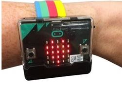

This project is gave me inspiration towards my design process as it shows how I could make the device wearable. Currently I do not have the materials and this is my first prototype, but for the final design I plan to have it so that the device is wearable. 

## Other research ##
YouTube Video
https://www.youtube.com/watch?v=sjNTQQ34LmE
I used this video to see how someone else went about making their micro bit wearable. It gave me idea about what I should do for my final design and how I’d attach it to the body. 

## Conceptual development ##

### Design intent ###
Wearable device that counts the amount of backflips you do

### Design ideation ###
### Design concept 1 ###
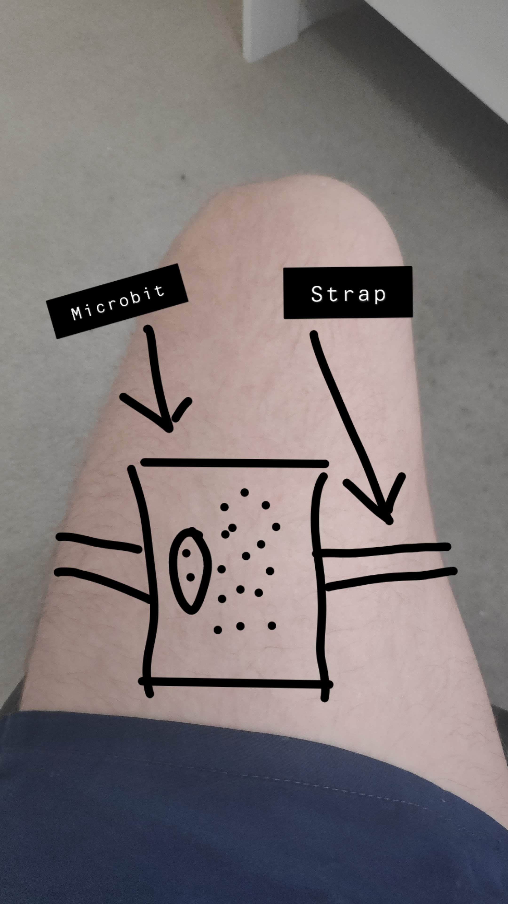

For my first design idea, I thought about attaching it your thigh and then having some sort of band that wrapped around. I thought that that would be a good idea at first, but then thought of the user experience in trying to wrap a small micro bit around their thigh and thought it might be a bit difficult. 

### Design concept 2 ###
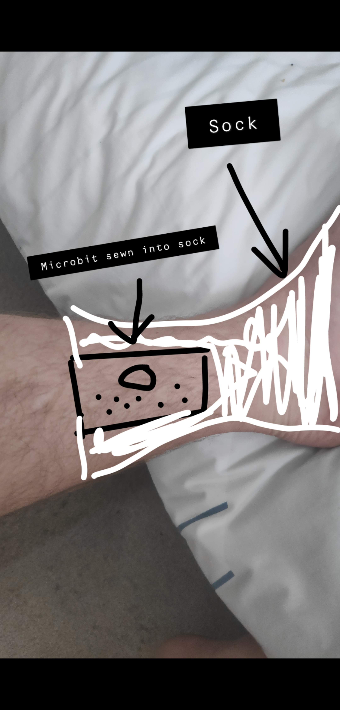
For the second design concept idea, I thought about putting the device around the ankle, and sewing the micro bit into a sock or a wearable device. This is a great idea, however it could interfere with the flexibility of your ankle while you are jumping. 

### Final design concept ###
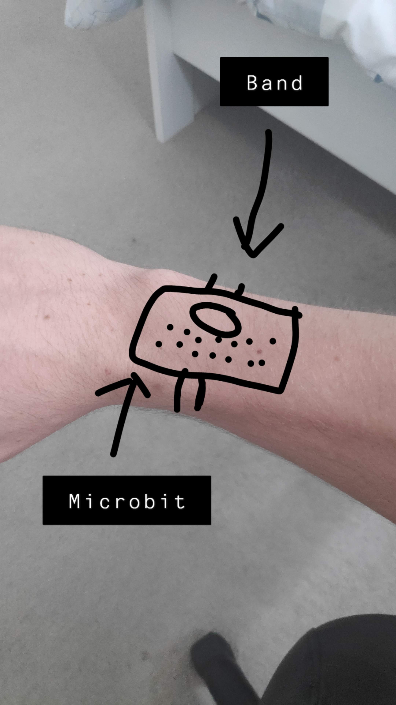
For the final design concept, I thought about having a strap or a band, so that it was like wearing a watch. This would interfere the least with the actual backflip and will most likely be the most comfortable for the user. I thought about either using an old sock or sewing it into it. The interaction for the user would be the most easy and familiar, as people have most likely worn watches before. The materials to be used would be cotton. I am also thinking about a strap like a watch, but I don’t know how I’d attach it to the micro bit. While writing this I came up with a final idea. I could glue the micro bit down to a piece of strong cardboard, and then make holes which can fit rubber band in. These rubber bands you would be able to squeeze over your arm to make it tight. 

### Final design concept ###
The final concept design I have made is a microbit attatched to rubber bands, which fit around your wrist. From my testing I found that this was the most robust design, as rubber bands are strong and stretchy. They are also useful as they can squeeze tighter to fit around smaller or larger wrists.

### Interaction flowchart ###
The interaction of this device is very user friendly and only needs a few instructions. Person puts the wearable device on > press ‘A’ to reset or > resume current score> do flips to make the score higher. 

## Process documentation ##

## Fabrication ##
Fabrication. The initial materials I was going to use was cotton, and to sew it onto a sock. However, I changed my mind when I realised I didn’t have any old socks I wanted to cut apart, and I also didn’t know how to sew. I thought about gluing the micro bit to a little bit of cardboard, or double sided taping it. Then having holes on this board which rubber bands would be able to attach onto, and onto your arms.  

## Final Concept ##
For the final concept I decided it was the best idea to use rubber bands. After a little bit of research and primary testing, I found that rubber bands were the strongest. I attempted to sew the microbit onto an old sock, however my sewing skills were not very good, and it did not turn out very good. 
 

## Design process discussion ##
The design process I formed, based particularly on the double diamond design strategy was that the main problems of design one and two were that they were not the most user friendly. Possible solutions that I came up with that could work were putting the micro bit onto your wrist. 

I was having lots of trouble figuring out the best way to attatch the microbit to my wrist. I also didn't have many materials where I live so working with what I had made it increasingly challenging. I found a few rubber bands throughout the house, and also learnt that it is a very strong material. 

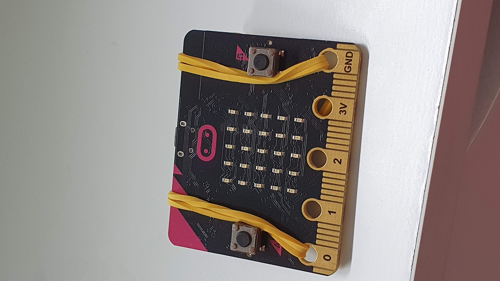
Step one of my final design process was threading rubber bands through the two end microbit holes. Doing this I was able to create a loop on the opposite side of the microbit. 

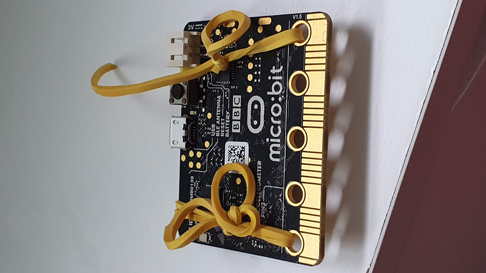
With this loop now in place, I was able to thread two more rubber bands through these, which are the rubber bands you will use to put the microbit onto your wrist. 

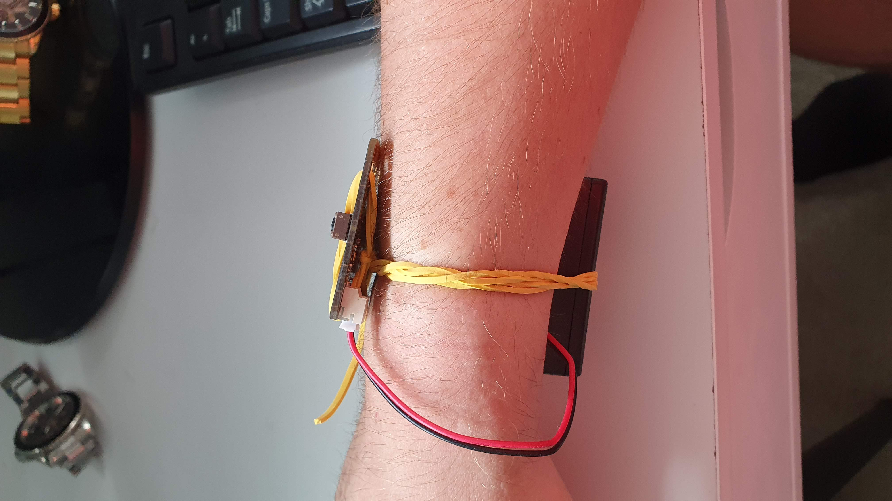
The external battery gets tucked underneath these two rubber bands, this keeps it secure, so it doesn't fall out when you're doing a flip. 

## Final code ##
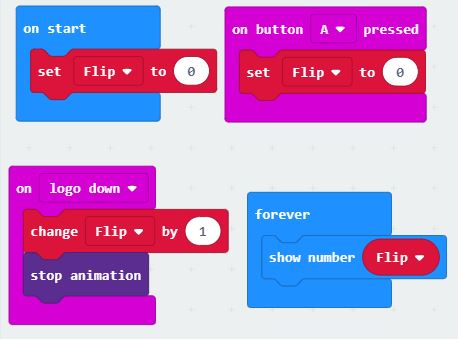

## Reflection ##
The techniques, approaches and skills I found useful from the related projects were learning about the different ways that you can attatch the microbit to your wrist, there are various different ways, however through learning about some of them, I concluded that there were effective ways and non effective ways.

If I was to improve on this product, I would want to 3D print a custom band case thing, which would fit the microbit onto, this would then have a built in battery and it would have a strap similar to a watch so that the product would fit perfectly. This would then be more of a finished product. 

The part of my project that I think is novel is the fact that it counts when you do flips. No other device or microbit project I've seen has ever done this before. This is a first of it's kind design, and could potentially be turned into an actual product to sell. 

An interesting extention of this could be used in gymnastics performances, however not only measuring how many flips, but the height of each flip and how many twists were in the flip. This could be used in the olympics to help judge the performances. 
